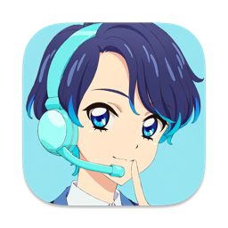
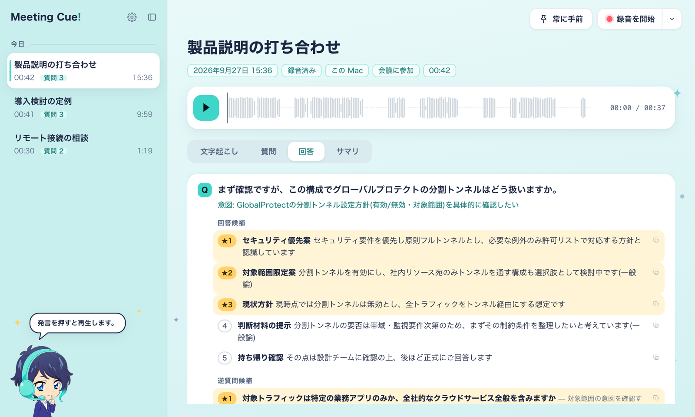
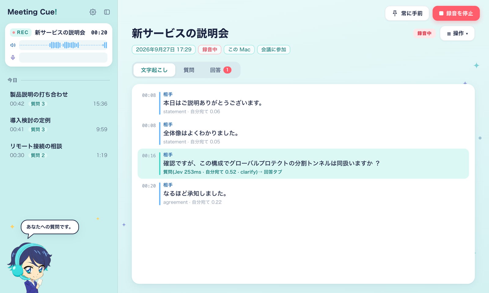
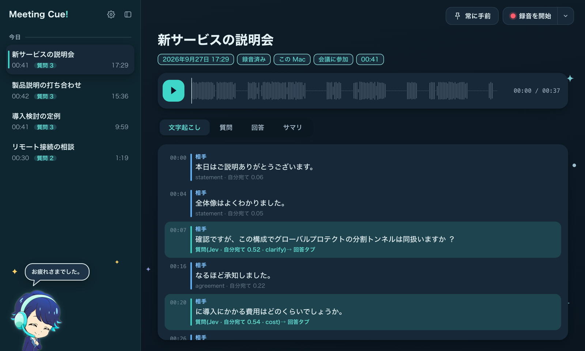
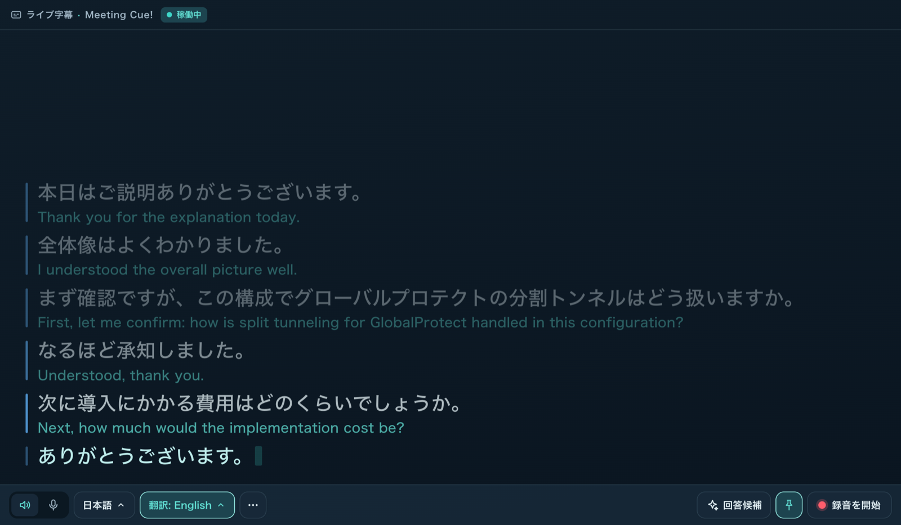
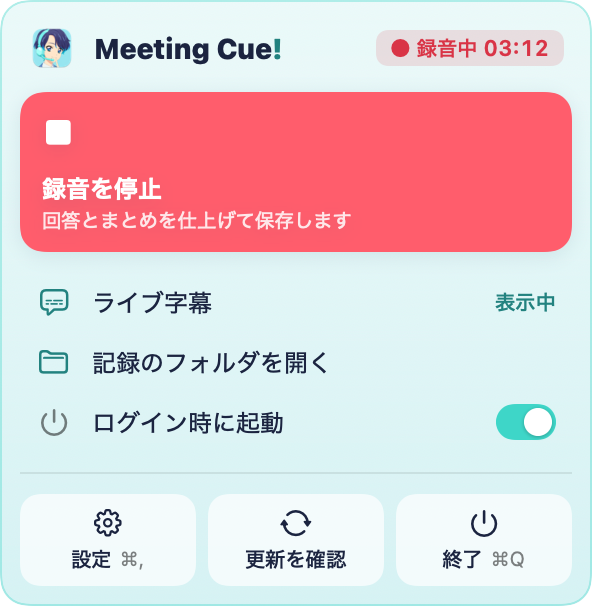

<p align="center"></p>

# Meeting Cue!

[](https://github.com/keigoly/meeting-cue/stargazers)
[](LICENSE)


会議や面接で**相手から質問されたら、その場で答えの候補をそっと差し出す** Mac / Windows 向けのアプリです。
会議の音声をパソコンの中で文字起こしし、相手の発言が自分への質問だと判定すると、回答候補と逆質問の候補を数秒で出します。音声そのものはパソコンの外へ出しません。

A macOS / Windows app that transcribes your meeting on-device and, when someone asks you a question, cues you with answer candidates and follow-up questions within seconds.

<p align="center"></p>

| 録音中(相手の質問を検知すると、ナギがきっかけを渡します) | ダークモード(録音後の再生と文字起こし) |
|---|---|
|  |  |
| **ライブ字幕(録音しなくても字幕・英訳)** | **メニューバー** |
|  |  |

<sub>写真の会話は、テスト用の合成音声(macOS の読み上げ・`tests/fixtures/make_fixtures.sh`)で作ったもので、実在の会議ではありません。</sub>

## できること

- **聞く**: 自分(マイク)と相手(会議アプリの音)を分けて、リアルタイムに文字起こしします(Mac は macOS 内蔵の音声認識、Windows は faster-whisper を GPU で)。音声はパソコンの外へ送りません
- **察する**: 相手の発言が「自分への質問」かどうかを、判定専用の AI(Jev)が約 0.25 秒で見分けます
- **差し出す**: 回答候補 5 つと逆質問 5 つを作り、採点して上位 3 つに ★ を付けます。最初の文字は約 1 秒で出始めます。Obsidian Vault のメモも根拠に使えます
- **先回り(質問タブ)**: 会話の流れから「今こちらから聞くとよいこと」を先に出します。相手から質問されたら、そちらが最優先です
- **振り返り**: 録音を波形付きで再生できます。文字起こしの行を押すとその位置から再生し、終わるとサマリを作ります
- **ライブ字幕**: 録音しなくても、スピーカーやマイクの音声を大きな字幕にします。確定した行を英語 / 日本語に訳せます。全画面の会議の上にも出せます
- **仕事の会議でも**: 通常は判定と候補づくりのために文字起こしの文を AI に送ります。**LOCAL** にするとクラウドへ一切送りません。「録音と文字起こしだけ」でも使えます
- **案内役のナギ**: 会議の袖に控えるプロンプターです。場面ごとに一言と表情が変わります(⚙ でオフにできます)
- **見た目**: ライト / ダーク(システムに合わせる)。基本色・相手・自分の 3 色を変えられます
- **置き換え辞書**: 音声認識がよく間違える固有名詞を、正しい語に直します
- **記録の整理**: 書き出し(音声 1 本・文字起こし・サマリ)/ Google Drive へ移動 / 削除
- **メニューバーに常駐**(Mac): ワンクリックで録音できます。アップデートの確認もここから

## 動作環境

### Mac

- macOS 26 以降(内蔵の音声認識 SpeechAnalyzer と、システム音声の取り込みを使います)
- Xcode Command Line Tools(Swift のヘルパーとアプリをビルドします)
- Python 3.12([uv](https://docs.astral.sh/uv/) を推奨。追加のパッケージは要りません)
- 生成 AI の API キー(OpenRouter / Anthropic / OpenAI のどれか)。質問の判定(Jev)には OpenRouter のキーを使います。キーが無くても「録音と文字起こしだけ」で使えます

### Windows

- Windows 10 バージョン 2004 以降 / Windows 11
- **NVIDIA の GPU**(VRAM 6 GB 以上を推奨。自分と相手の 2 本で約 4.8 GB 使います)。音声認識は faster-whisper(large-v3-turbo)を GPU で動かします。GPU の無いパソコンには、まだ対応していません
- [uv](https://docs.astral.sh/uv/)(`winget install --id astral-sh.uv -e`)。Python 3.12 は uv が用意します
- 空き容量 約 5 GB(初回に音声認識のモデルと GPU 用の部品 約 3.7 GB を取得します。会議中はネットに取りに行きません)
- 生成 AI の API キーは Mac と同じです(Windows の資格情報マネージャーに保存します)

## セットアップ

### Mac

```sh
git clone https://github.com/keigoly/meeting-cue.git
cd meeting-cue
(cd helpers/macos && make)        # Swift のヘルパーをビルド
packaging/make_mac_app.sh         # ~/Applications/Meeting Cue!.app を作る
```

`Meeting Cue!.app` を開くと、はじめの案内で使い方(AI で支援する / 録音と文字起こしだけ)と API キーを設定できます。キーは Mac のキーチェーンに保存します。
最初の録音で、マイクとシステム音声録音の許可を求められます。

### Windows

PowerShell で(git が無ければ、GitHub の「Code → Download ZIP」で取って展開したフォルダで):

```powershell
git clone https://github.com/keigoly/meeting-cue.git
cd meeting-cue
powershell -NoProfile -ExecutionPolicy Bypass -File packaging\windows\setup.ps1
```

`setup.ps1` は、前提の検査(Windows の版・NVIDIA の GPU)→ 音声認識の専用環境とモデル → ウィンドウの環境 → スタートメニューへの登録までを行います。何度実行しても大丈夫です(入っているものは飛ばします)。
終わったら、スタートメニューの **Meeting Cue!** から開きます。はじめの案内は Mac と同じです。相手の声は、既定のスピーカー(出力機器)で鳴っている音から取ります。ライブ字幕はウィンドウのメニュー「表示 → ライブ字幕」から開きます。
取り込む機器を変えるとき・アンインストールの手順は [docs/USAGE.md](docs/USAGE.md#windows) にあります。

### Obsidian Vault を知識として使う(任意)

```sh
mkdir -p ~/.meeting-cue && cp config.example.toml ~/.meeting-cue/config.toml   # vault_root を自分の Vault に
uv run --python 3.12 --no-project python -m meetcue.cli index                    # 索引を作る(以後は差分だけ)
```

### 動作の確認(任意)

```sh
tests/fixtures/make_fixtures.sh                                            # 合成音声のテスト素材を作る
uv run --python 3.12 --no-project python -m meetcue.cli doctor --online   # 前提の検査
uv run --python 3.12 --no-project --with pytest python -m pytest -q       # 試験
```

画面ごとの操作・設定・記録の場所・ターミナルからの使い方は [docs/USAGE.md](docs/USAGE.md) にあります。

## キー操作

| キー | 動作 |
|---|---|
| ⌃⌥P | 一時停止 / 再開(文字起こしは続け、判定と生成を止める) |
| ⌃⌥D | 今の発言を深掘り(直近の相手の発言で候補を作る) |
| ⌃⌥M | 立場の切り替え(会議に参加 → 登壇・発表 → 講演を聴く) |
| ⌃⌥L | ライブ字幕を固定(クリックが下へ抜ける)⇄ 動かせる |
| ⌃⌥H | ライブ字幕の表示 / 非表示 |
| ⌃⌥R | 画面の再読み込み |
| Space | 録音後の再生 / 一時停止 |
| ⌘, / ⌘Q | 設定を開く / 終了(録音中なら保存してから終わる) |

キー操作は Mac のものです。Windows 版には、まだシステム全体のホットキーがありません(画面のボタンとウィンドウのメニューで操作します)。

## 構成

| ファイル | 役割 |
|---|---|
| `meetcue/app.py` | アプリの本体(録音の開始・停止・設定・記録の一覧) |
| `meetcue/pipeline.py` | 文字起こし → 質問の判定 → 候補の生成 → 採点の流れ |
| `meetcue/segmenter.py` | 発言の区切り(間の長さと文末の形で確定を決める) |
| `meetcue/judge/` | 質問の判定(Jev・つながらないときの簡易判定)と、候補の採点(選ぶ係) |
| `meetcue/cues/` | 生成 AI への接続(OpenRouter / Anthropic / OpenAI)と指示文 |
| `meetcue/knowledge/` | Obsidian Vault の索引と検索(SQLite FTS5) |
| `meetcue/captions.py` | ライブ字幕と翻訳 |
| `meetcue/ui/` | 画面(標準ライブラリの HTTP + SSE と、ビルド不要の HTML) |
| `helpers/macos/` | Swift のヘルパー(音声認識・会議アプリの音の取り込み・ホットキー・ウィンドウとメニューバー) |
| `helpers/windows/` | Windows のヘルパー(音声認識 faster-whisper・取り込み PyAudioWPatch・ウィンドウ pywebview・書き出し)。本体とは別の仮想環境で動きます |
| `packaging/` | アプリの作成と起動・アイコン(Windows は `packaging/windows/`) |
| `tests/`・`eval/` | 試験と、判定・文字起こしの評価 |

設計の正本は [docs/REQUIREMENTS.md](docs/REQUIREMENTS.md)、進め方は [DEVELOPMENT.md](DEVELOPMENT.md)、初期の実測は [spikes/PHASE0_RESULTS.md](spikes/PHASE0_RESULTS.md) にあります。

## 制限

- 会議の言語は日本語が中心です(ライブ字幕は英語にも対応しています)
- 相手の声は、このパソコンで鳴っている会議アプリの音から取ります。スマートフォンなど別の機器で鳴らした音は入りません
- Windows 版(初版)の制限:
  - 相手の声は、出力機器で鳴っている音をまとめて取ります(Mac のように会議アプリだけを選べません)。会議中に音楽や動画を流すと、それも文字起こしに入ります
  - タスクトレイへの常駐・システム全体のホットキー・自動アップデート・字幕の固定(クリックを下へ通す)・Google Drive への移動は、まだありません。更新は `git pull` のあとに `setup.ps1` を実行します
  - NVIDIA の GPU が必要です
  - 画面の一部の説明文が Mac 向けのままです(例: キーの保存先の説明)
- 音声認識は固有名詞に弱いことがあります(置き換え辞書で直せます)
- 「アップデートを確認」は、手元の clone より新しいコミットがあるかを見ます(GitHub のリリースには未対応です)

## ライセンス

MIT ライセンスです([LICENSE](LICENSE))。

Windows 版は faster-whisper・Whisper large-v3-turbo(MIT)・PyAudioWPatch(MIT)・pywebview(BSD-3-Clause)などを使います(`setup.ps1` が利用者の手元に取得します)。

macOS は Apple Inc. の商標です。Windows は Microsoft Corporation の商標です。Zoom・Google Meet・Microsoft Teams・Obsidian・Claude・ChatGPT などの名称は、それぞれの権利者の商標です。本プロジェクトはこれらの企業とは関係ありません。
